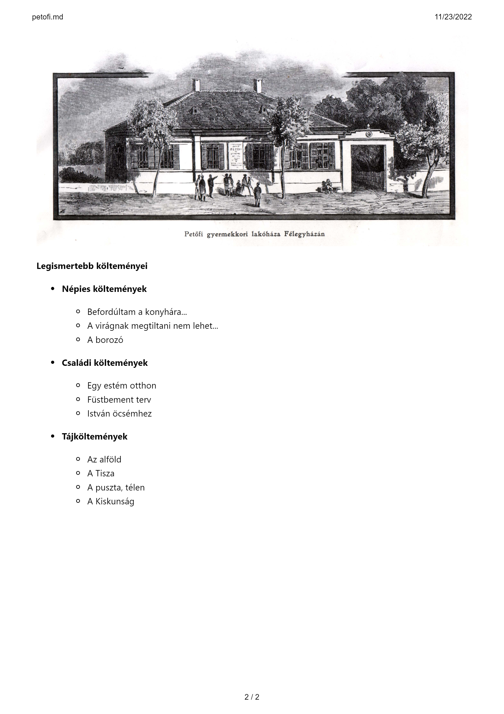

# Petőfi Sándor

Petőfi Sándor (született Petrovics Sándor, Kiskőrös, 1823. január 1. -- Fehéregyháza körül, 1849. július 31.) magyar költő, forradalmár, nemzeti
hős, a magyar költészet egyik legismertebb és egyik legkiemelkedőbb alakja. Rövid élete alatt közel ezer verset írt magyarul, ebből
körülbelül nyolcszázötven maradt az utókorra, és az ismertebbeket sok más nyelvre lefordították.

A tanulást tizennyolc esztendős korában abbahagyva színész lett, és ekkor kezdett verseket írni. 1844-től élt Pesten, majd 1846-tól baráti
körével irodalmi társaságot szervezett. Fiatal kora ellenére ekkorra már országos ismertségre tett szert. A „márciusi ifjak" egyik vezetőjeként
részt vett az 1848. március 15-i forradalomban, amelynek a szimbólumává vált. A 26 éves költő ezután a szabadságharc küzdelmeiben is részt
vállalt. A történészek mai álláspontja szerint életét is áldozta a magyar szabadságért, hiszen 1849. július 31-én esett el a segesvári
csatát követő fejvesztett menekülés közben. A Szkarjatyin tábornok halálán felbőszült kozák ulánusok az üldözött honvédeket kíméletlenül
lemészárolták. Eltűnésének minden körülménye azonban még a mai napig sem tisztázódott.

## Származása, gyermekkora

Édesapja Petrovics István (Kartal, 1791. augusztus 15. -- Pest, 1849. március 21.) mészárosmester, felvidéki szlovák családból származott (a
közhiedelemben elterjedt szerb származással szemben), de ő magyarnak vallotta magát. Apjának szlovák származását valószínűsíti annak
evangélikus vallása (a szerbek általában ortodoxok), illetve Kiss József és Jakus Lajos kutatásai, akik apai ágon 1685-ig, a Nyitra vármegyei
Vagyócig vezették vissza Petőfi származását. Vagyis a Petrovicsok csakúgy Felvidékről származnak, mint az anyai ág, amely a Turóc
vármegyei Necpál községből ered. Apai nagyapja Petrovics Tamás, aki 1770-ben 26 évesen költözött el Aszódra.

## Tanulóévei

Petőfi eleven, elmés, kissé makacs, de jószívű gyermek volt. Kemény apja szigorúsággal, anyja gyöngédségével vezette. Édesapja lehetőségeihez
mérten megpróbálta a legjobb iskoláztatást biztosítani gyermekeinek. Az ifjú Petőfi összesen kilenc iskolában tanult, már ötévesen koptatta az
iskolapadot. Félegyházán ment először iskolába, de csak vendégként járt be a római katolikus elemibe egy ideig 1828 elején. Már ezt megelőzően
oktatták olvasásra és rajzra, a rajzhoz később is kedvet mutatott. Ezután három évig Kecskeméten tanult: először 1828. május 10-én vitte
apja az evangélikus népiskolába, ott íratta be 1829. május 10-én a második, illetve 1830. május 15-én a harmadik elemibe is. Az
intézményben már némi latint is tanult. Szállása Habel Józsefnél volt, aki akkor az öreg Petrovics félegyházi és kecskeméti mészárszékének
haszonbérlőtársa volt. Vakációzni haza, vagy kiskőrösi rokonaihoz járt.

**Legismertebb költeményei**

- **Népies költemények**
  - Befordúltam a konyhára...
  - A virágnak megtiltani nem lehet...
  - A borozó

- **Családi költemények**
  - Egy estém otthon
  - Füstbement terv
  - István öcsémhez

- **Tájköltemények**
  - Az alföld
  - A Tisza
  - A puszta, télen
  - A Kiskunság